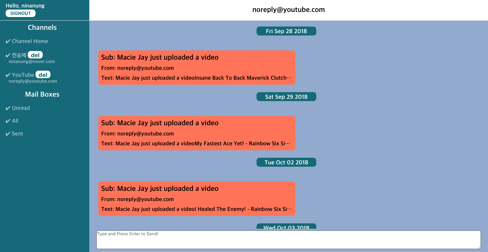

better e-mail client

## Why should i make this?

People already have so many message app, but email still not dead. Espacially in the company, we send and receive so many emails. But most of email client have bad UI, just show the list what user receive and send. It is not comfortable and easy, also not cool at all. So, "bec" is here.

## So?

This is plan.  
  
Yeah, this is chat like UI. User can send email by simple typing and clicking. Also can see all emails with chat UI.  
This is just example image and can be changed any time. But i wiil try not to change goal for usability, simplicity and scalability.  

## Notice

This project is public now, but can be changed to private.  

## What i first try in this project

1. ~~Complicate websocket event~~
2. ~~Using Imap(email base product)~~
3. ~~Web notification~~

First, Websocket is built with `socket.io`. It was pretty simpler than i thought. Actually i misunderstood how to use `socket.io`. I thought it can be only used like `client send event -> server recieve event -> send back to client` scenario, but it was not. `send event anywhere -> recieve event anywhere -> send data to anywhere need to recieve` is right. So i can now easily control if new mail come in to mailbox.  

Second, IMAP was pretty difficult. Cause i have never made the mail related wabapp. But now, i used to it, and know how IMAP do it's work. At first, i made server to request mails everytime user change the channel, but i realized it is dumbest way to get mails. Connecting to mail server is not fast, actually it is pretty slow. So now, server only request mails when user sign-in and if websocket send event(new mails), server request only new mails, not all.  

Third, Ok, done. I'm using Google's Firebase Cloud Messaging(FCM). When new mail detected in the server, send socket event and push notification. Firebase is interesting also easy to set and control. I finally understood why people like Firebase. There're even more tools that i can use for PWA. Yeah, PWA, i find this word while making this webapp. Progressive Web App(PWA), i don't fully understand about this yet, but i want to try something "Progressive"!  

## Progress

2018-10-17  
  