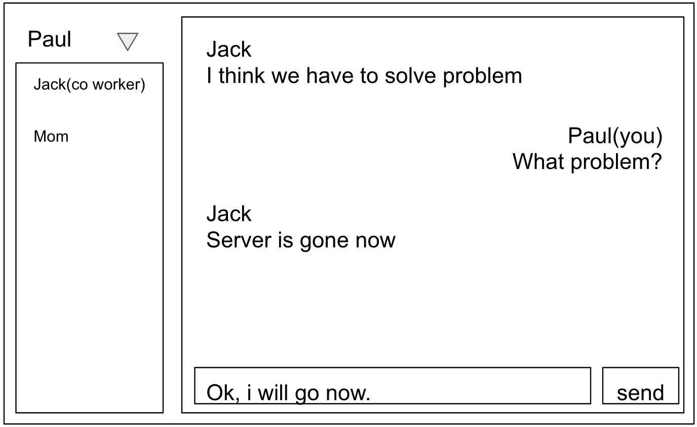

# bec

better e-mail client

## Why should i make this?

People already have so many message app, but email still not dead. Espacially in the company, we send and receive so many emails. But most of email client have bad UI, just show the list what user receive and send. It is not comfortable and easy, also not cool at all. So, "bec" is here.

## So?

This is plan.  
  
Yeah, this is chat like UI. User can send email by simple typing and clicking. Also can see all emails with chat UI.  
This is just example image and can be changed any time. But i wiil try not to change goal for usability, simplicity and scalability.  

## Notice

This project is public now, but can be changed to private.